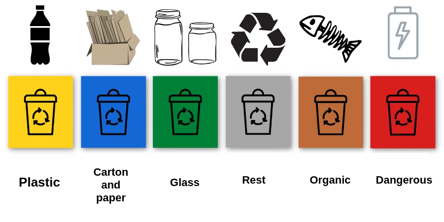
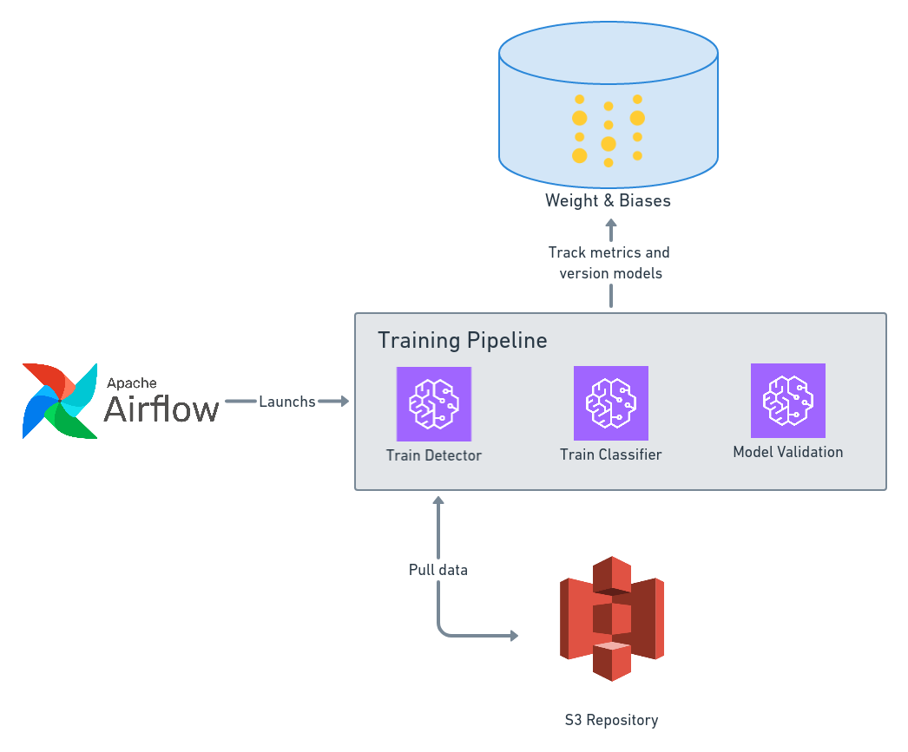
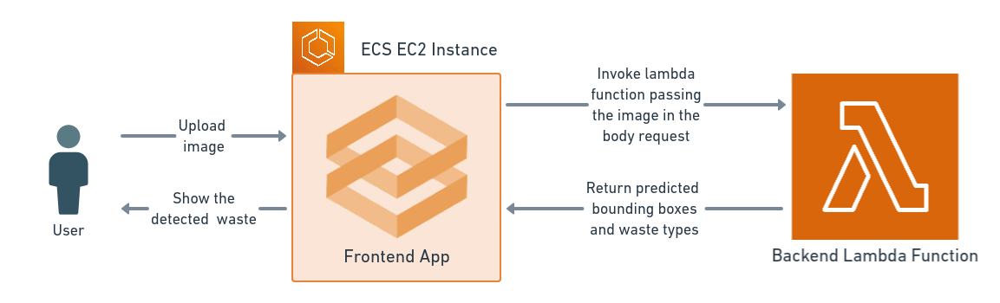
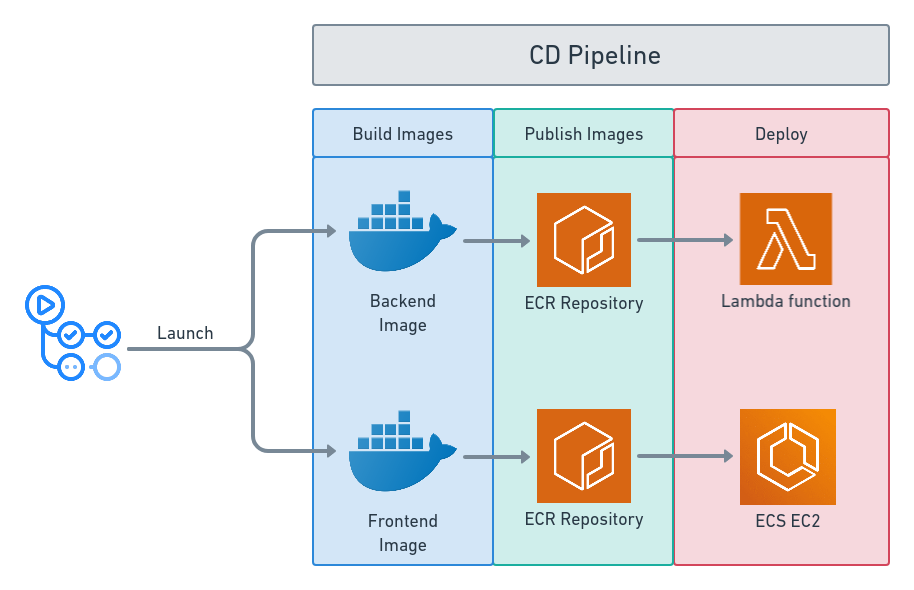
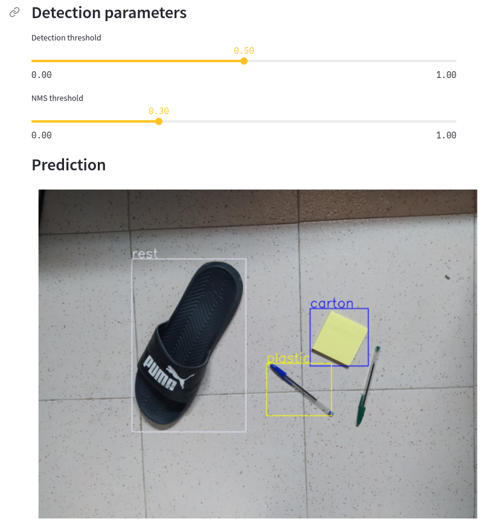

# Waste-Detector
Waste recycling is quite controversial due to some people's confusion about which container some waste should be disposed of. This repository contains a deep learning-based system to detect and classify waste according to which container it should be disposed of. 

Currently, in Spain, we have six waste containers of six different colors depending on the type of waste to be disposed of. The colours and the type of waste are defined in the following table:

| Type of Waste  | Color |   
|----------------|-------|
|        Organic        |   Orange    |   
|        Carton and paper        | Blue      |   
|        Glass     |  Green    |
|        General        |  Grey    |
|        Plastics        |  Yellow     |
|        Dangerous        |   Red    |

## :star: Solution
After several experiments and reading [4], I decided to split the task into two subproblems: Detecting and classifying the waste. The first subproblem was solved using an object detection model to detect the waste in the images. The second subproblem was solved using a classification model to classify the detected waste by the previous model.

The experimentation was done using three different datasets, which needed different preprocesses to be used in this task:
- [MJU-Waste dataset](https://github.com/realwecan/mju-waste) [1]. This dataset contains images with just one waste object for each image. Besides, it provides bounding boxes annotations and masks in COCO [2] format. Few considerations:
	- The bounding boxes annotations were wrong, so **they were recalculated using the masks provided**.
	- The waste was classified in a unique class, so **I had to label the entire dataset into the six desired categories manually**.
- [TACO dataset](http://tacodataset.org/) [3]. This dataset contains images with multiple waste objects for each image. Besides, the waste objects are labeled into 59 categories. Few considerations:
	- The 59 categories were joined into the six desired ones.
	- There were relatively small objects such as cigarettes. **I defined an object area threshold and removed such small objects**.
- [Background dataset](https://medium.com/maarten-sukel/garbage-object-detection-using-pytorch-and-yolov3-d6c4e0424a10). This dataset was originally built to detect garbage in streets. Therefore, **I had to manually inspect the images and select those without any street garbage**. Thus, these images could be used as background images with no waste.
	
### :book: System Diagrams
This first diagram shows how the training pipeline is organized:
- The pipeline is managed using Airflow. It contains two DAGs: one for training and another one for validation.
- Both training and validation is done using AWS Sagemaker
- It uses Weight&Biases to track the experiments metrics, hyperparameters and output. Besides, it is also used as model versioner.

This second diagram shows how the inference works:
- The user uploads an image to the Gradio App running on a ECS EC2 instance.
- The frontend invokes the lambda function passing the image in the request body to get the predictions.
- The frontend receives the predictions and shows the detected waste on the image.

This third and last diagram shows the CD pipeline to deploy both the backend and frontend:
- The entire workflow runs on GitHub Actions.
- It builds both the frontend and backend images. Then, they are pushed to ECR repositories.
- The backend is deployed as a Lambda function.
- The frontend is deployed into an EC2 instance managed by an ECS service.

  
### :tv: Project Demo
The application is already deployed in this [url](http://ec2-54-155-101-152.eu-west-1.compute.amazonaws.com:8501/). It allows a user to use an existing example image or to upload upload a custom image. Also, the user can change both the detection threshold and the NMS threshold to optimize the object detection.

  
### :red_car: Roadmap
- [x] First version using only the TACO dataset
- [x] Fix the MJU bounding boxes annotations and manually label each image
- [x] Add the MJU data to the system
- [x] Deploy on HugginfaceSpaces
- [X] Decide whether to add images from other datasets or implement data-centric approaches.
- [X] Set a custom infrastructure
- [X] Create a CI/CD pipeline
- [X] Create a Continuous Training pipeline
- [ ] Set up a model monitoring system 

### :mag_right: References

[1] Tao Wang, Yuanzheng Cai, Lingyu Liang, Dongyi Ye. [A Multi-Level Approach to Waste Object Segmentation](https://doi.org/10.3390/s20143816). Sensors 2020, 20(14), 3816.

[2] Lin, T. Y., Maire, M., Belongie, S., Hays, J., Perona, P., Ramanan,  D., ... & Zitnick, C. L. (2014, September). Microsoft coco: Common  objects in context. In European conference on computer vision (pp.  740-755). Springer, Cham.

[3] Proença, P.F.; Simões, P. TACO: Trash Annotations in Context for Litter Detection. arXiv **2020**, arXiv:2003.06975.

[4] S. Majchrowska et al., “Waste detection in Pomerania: non-profit project for detecting waste in environment,” CoRR, vol. abs/2105.06808, 2021.
