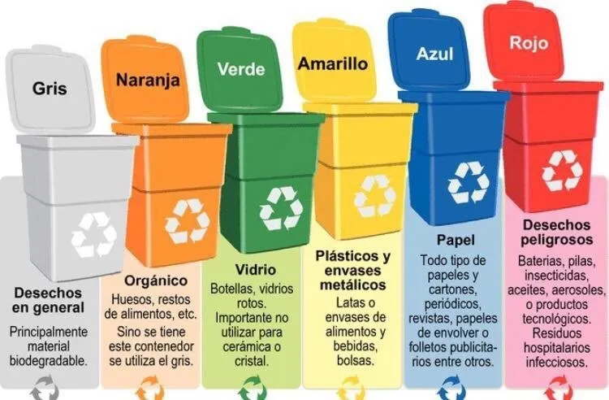
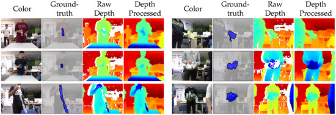
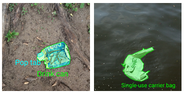

# Waste-Detector
This repository contains a deep learning-based system to detect and classify waste according to which container it should be thrown into. 

There are the following garbage bins in Spain:

- Organic: Orange

- Carton and paper: Blue

- Glass: Green

- General waste: Gray

- Plastics: Yellow

- Dangerous waste: Red

  

### Datasets

- [MJU-Waste dataset](https://github.com/realwecan/mju-waste) [1]. This dataset contains a set of images annotated in PASCAL VOC [2] format. Object instance annotations in COCO [2] format are also available. This dataset contains RGB images and depth image pairs. [Paper](https://www.mdpi.com/1424-8220/20/14/3816/htm)

  

  

  

- [TACO dataset](http://tacodataset.org/) [4]. This dataset a public benchmark for waste object segmentation. Images are collected from mainly outdoor environments such as woods, roads and beaches. It is also annotated in COCO [2] format.

  
  
### State
Performing both the box and class prediction at the same time leads to poor results. The problem will be divided into two scenarios: first, the bounding box predictions using a unique waste class, thus, allowing the classification of the waste inside the bounding box as in [5].
Besides, I will add more data because actually only the TACO dataset is being used.

### Roadmap

- [ ] Create a design doc using this [template](https://github.com/eugeneyan/ml-design-docs)
- [ ] Create a high level diagram
- [x] Explore the data
- [x] Set a baseline
- [ ] Optimize the model
- [ ] Set a infrastructure 

### References

[1] Tao Wang, Yuanzheng Cai, Lingyu Liang, Dongyi Ye. [A Multi-Level Approach to Waste Object Segmentation](https://doi.org/10.3390/s20143816). Sensors 2020, 20(14), 3816.

[2] Everingham, M., Van Gool, L., Williams, C. K., Winn, J., &  Zisserman, A. (2010). The pascal visual object classes (voc) challenge.  International journal of computer vision, 88(2), 303-338.

[3] Lin, T. Y., Maire, M., Belongie, S., Hays, J., Perona, P., Ramanan,  D., ... & Zitnick, C. L. (2014, September). Microsoft coco: Common  objects in context. In European conference on computer vision (pp.  740-755). Springer, Cham.

[4] Proença, P.F.; Simões, P. TACO: Trash Annotations in Context for Litter Detection. arXiv **2020**, arXiv:2003.06975.

[5] S. Majchrowska et al., “Waste detection in Pomerania: non-profit project for detecting waste in environment,” CoRR, vol. abs/2105.06808, 2021.
