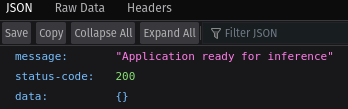

## Description

This folder contains the files needed for a local deployment. The stack used is the following:

- **Gradio** for providing the frontend.
- **FastAPI** for serving the models in the `/predict` endpoint.
- **Huggingface Hub** for storing the models so they can be downloaded by anyone.
- **Docker** to create containers for both the backend and frontend.

### Usage

The first time we use the application we must build the docker images. Since a docker-compose file is provided, you can use the following command:

```bash
docker compose build
```

After building the images, you mas start both services by using the following command:

```
docker compose up
```

The frontend is located in the port **8501**, while the backend is located in the port **5000**.


The backend is configured in a way that it load the models at startup, so the application won't work until the models are properly loaded. You can check if the application is ready to make predictions by accessing the following endpoint in the browser:

```
http://localhost:5000
```

This endpoint will show the following page in case that the application is ready:



At this moment you can use the Gradio app located in `http://localhost:5000`. 

